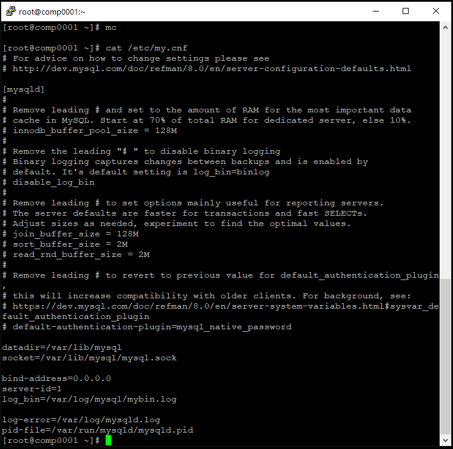
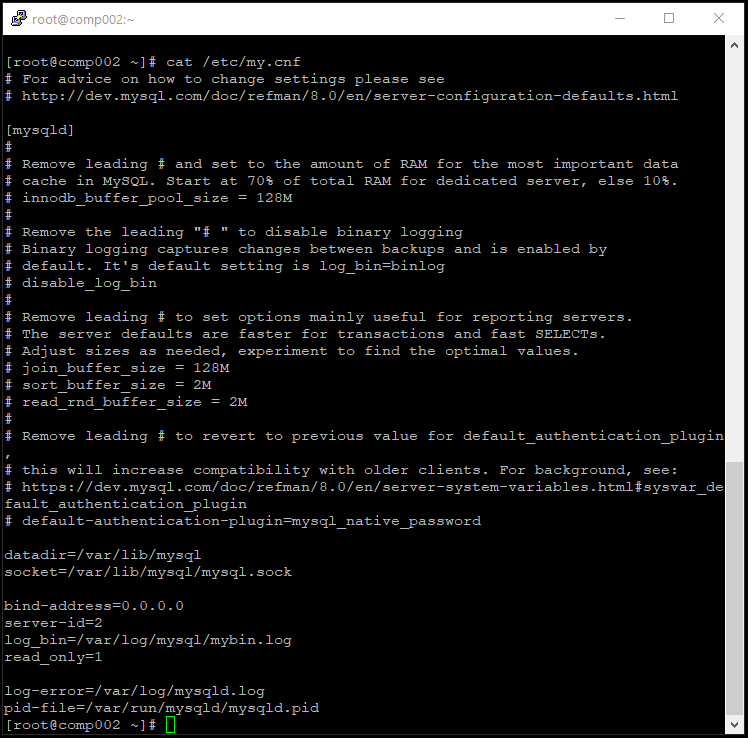
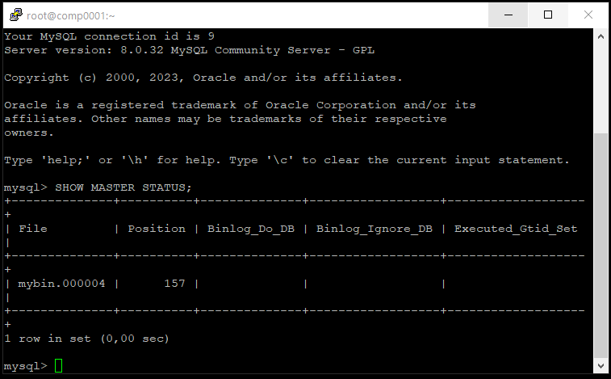
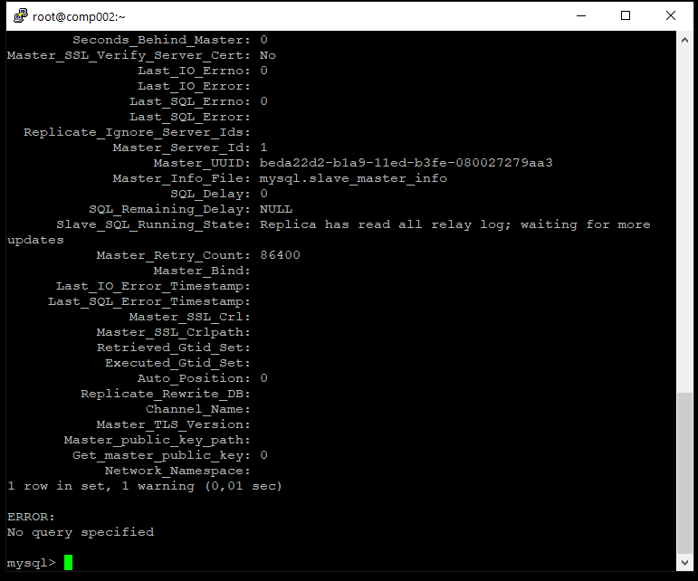
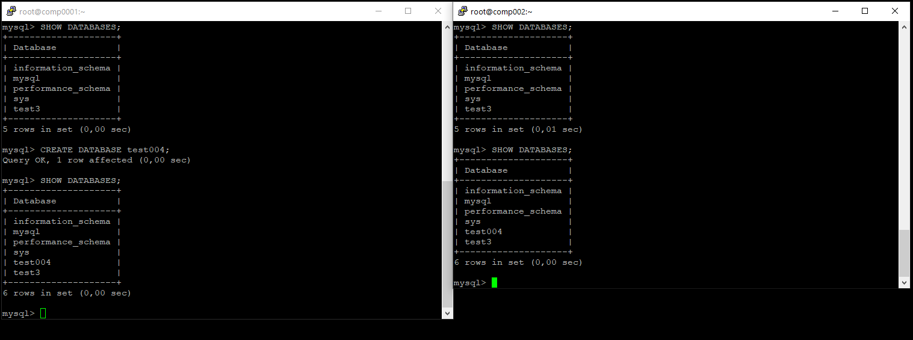

# Домашнее задание к занятию "Репликация и масштабирование Часть 1" - `Тимохин Виталий`

### Задание 1.

На лекции рассматривались режимы репликации master-slave, master-master, опишите их различия.

Ответить в свободной форме.

`При репликации Master-Slave операции записи в БД клиентским ПО производятся только на сервер Master, чтение возможно как с сервера Master, так и с сервера Slave. Slave копирует изменение двоичного журнала (binary log) с сервера Master в свой журнал ретрансляции (relay log), воспроизводит изменения из журнала ретрансляции применяя их к собственным данным.`

`При репликации Master-Master операции чтения и записи в БД клиентским ПО могут производиться на любой из серверов.`

`Репликация Master-Master позволяет копировать данные с одного сервера на другой. Эта конфигурация добавляет избыточность и повышает эффективность при обращении к данным.`

`Master-Master репликации – это настройка обычной Master-Slave репликации, только в обе стороны (каждый сервер является мастером и слейвом одновременно).`

### Задание 2.

Выполните конфигурацию master-slave репликации, примером можно пользоваться из лекции.

Приложите скриншоты конфигурации, выполнения работы: состояния и режимы работы серверов.

`На скриншоте приведен файл конфигурации my.cnf сервера Master.`

`На скриншоте приведен файл конфигурации my.cnf сервера Slave.`

`На скриншоте приведен результат выполнения запроса SHOW MASTER STATUS на сервере Master.`

`На скриншотах приведен результат выполнения запроса SHOW SLAVE STATUS\G на сервере Slave.`

`На скриншоте приведен результат работы репликации master-slave при создании БД test004 на сервере Master с репликацией на сервер Slave.`

