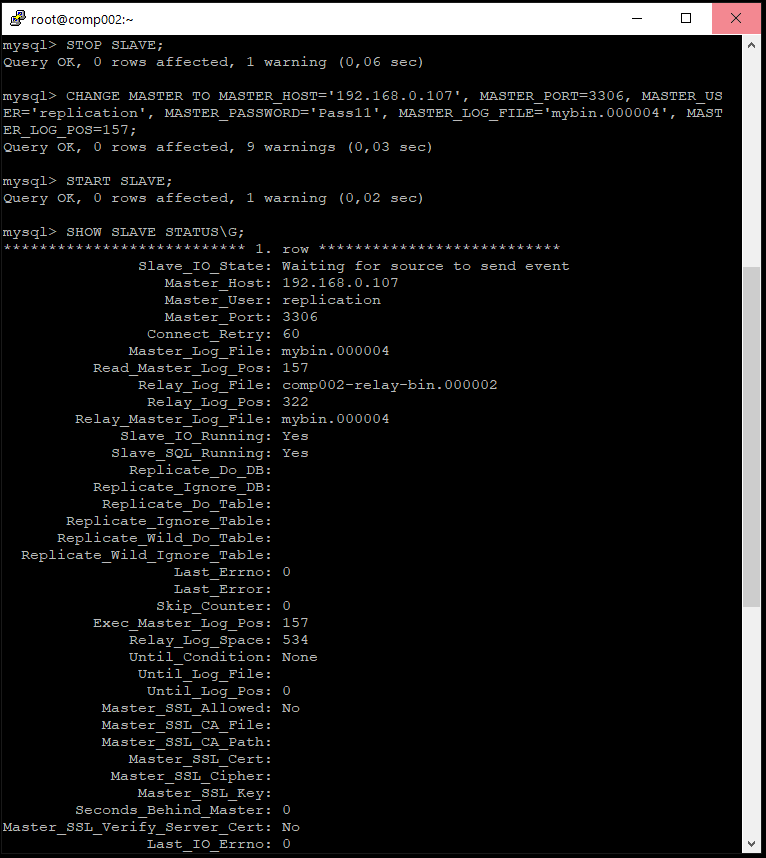

# Домашнее задание к занятию "Индексы" - `Тимохин Виталий`

### Задание 1.

На лекции рассматривались режимы репликации master-slave, master-master, опишите их различия.

Ответить в свободной форме.
```
При репликации Master-Slave операции записи в БД клиентским ПО производятся только на сервер Master, чтение возможно как с сервера Master, так и с сервера Slave. Slave копирует изменение двоичного журнала (binary log) с сервера Master в свой журнал ретрансляции (relay log), воспроизводит изменения из журнала ретрансляции применяя их к собственным данным.
```

```
Репликация Master-Master позволяет копировать данные с одного сервера на другой. Эта конфигурация добавляет избыточность и повышает эффективность при обращении к данным.
```

```
Master-Master репликации – это настройка обычной Master-Slave репликации, только в обе стороны (каждый сервер является мастером и слейвом одновременно).
```

### Задание 2.

Выполните конфигурацию master-slave репликации, примером можно пользоваться из лекции.

Приложите скриншоты конфигурации, выполнения работы: состояния и режимы работы серверов.

`На скриншоте приведен файл конфигурации my.cnf сервера Master.`


`На скриншоте приведен файл конфигурации my.cnf сервера Slave.`


`На скриншоте приведен результат выполнения запроса SHOW MASTER STATUS; на сервере Master.`


`На скриншотах приведен результат выполнения запроса SHOW SLAVE STATUS\G; на сервере Slave.`




`На скриншоте приведен результат работы репликации master-slave при создании БД test004 на сервере.Master с репликацией на сервер Slave.`


### Задание 3*

Самостоятельно изучите, какие типы индексов используются в PostgreSQL. Перечислите те индексы, которые используются в PostgreSQL, а в MySQL — нет.

*Приведите ответ в свободной форме.*

`В PostgreSQL ипользуются неиспользуемые в MySQL следующие индексы: Bitmap index, Partial index, Function based index.`